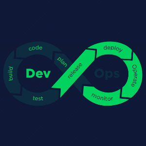
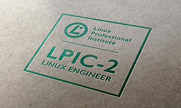
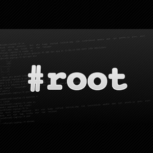

# Eduardo Silva Capeletti
***IT Professional  | OpenSource***

---

---

## Quem sou eu!

#### Técnico em informática desde quando se instalava s.o com disquetes. Aprendendo desafios novos, ***sysadmim e devops*** é o foco principal.

---

### Sigam minhas redes sociais
 |  |  | 

---

Nesse mundo da tecnologia ficar parado significa estar desatualizado, sempre temos que estar nos preparando e adquirindo conhecimentos. Nesse site pessoal vou mostrar meus planos de estudos, e a evolução de cada etapa, pretendo focar na área de SYSADMIN e DEVOPS.

---

### O que estou aprendendo agora

---

Clique na imagem para ver o conteúdo.

---

 | 

---
