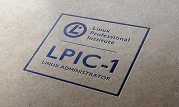

[Voltar a página principal](index.md)

---

***Curso Linux Administrator | Certificação LPI 1 (50 Horas)*** - ForceLinux

- [x] Bourne Again SHell
    * Alternar entre Runlevels, desligar e reiniciar o sistema
    * Trabalhar na Shell Bash
    * Processar Fluxo de textos com uso de Filtros
    * Fluxos de Dados, Pipes e Redirecionamentos
    * Encontrar Arquivos e Diretórios usando Expressões Regulares
    * Encontrar Arquivos e Diretórios e Conhecer seu Path completo
    * Editar Textos com Nano e Vim
- [x] Hardware e Dispositivos
    * Identificar e Editar Configurações de Hardware
    * Dimensionar Partições de Discos
    * Gerenciar Arquivos
    * Criar Partições para Sistemas de Arquivos
    * Manutenção de Integridade de Sistemas de Arquivos
    * Controle de Montagem e Desmontagem dos Sistemas de Arquivos
    * Criar e Alterar Links Simbólicos e Hardlinks
- [x] Sistemas em Rede
    * Fundamentos dos Protocolos de Internet
    * Configuração Básica de Rede
    * Soluções para Problemas de Rede
    * Configuração de Cliente DNS
    * Gerenciamento de Pacotes Debian
    * Gerenciamento de Pacotes Red Hat
- [x] Administração de Ambiente e Usuários Unix
    * Controlar Bibliotecas Compartilhadas
    * Criar, Monitorar e Finalizar Processos
    * Modificar a Prioridade de Execução de um Processo
    * Administrar Quotas de Disco
    * Controlar Permissões e Propriedades de Arquivos
    * Administrar Contas de Usuários, Grupos e Arquivos de Sistema Relacionados
- [x] Shell Script, SQL e Inicialização de Sistema
    * Personalizar e Trabalhar no Shell Environment
    * Automatizar Rotinas com Scripts
    * Administração de Dados SQL em MySQL Server
    * Inodes, Hardlinks e Softlinks
    * Sistema de Inicialização System V
    * Definindo um serviço no Boot
- [x] Princípios de Segurança
    * Tarefas Administrativas de Segurança
    * Restrição de Acesso com TCP Wrapers
    * Acesso Seguro a Hosts
    * Proteção de Dados com Criptografia
     
---

    # [ForceLinux](https://www.linuxforce.com.br/curso-linux/curso-engenheiro-linux/)